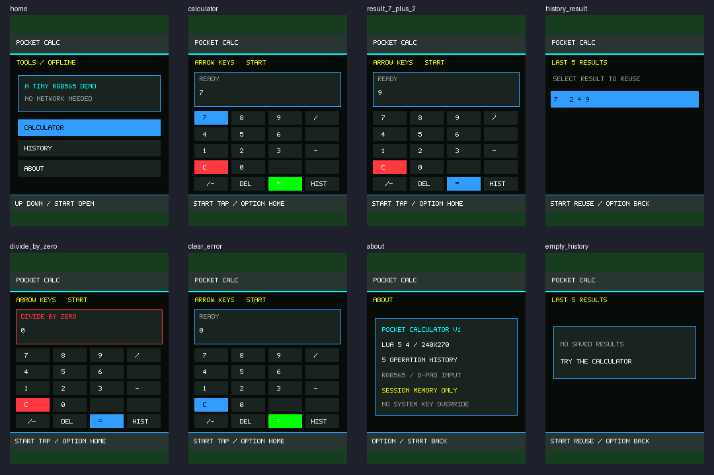

# QEAPP-Studio

**IDE độc lập để tạo, kiểm thử và đóng gói ứng dụng cho VQEAF-OS.** QEAPP-Studio là công cụ phát triển chạy trên PC (Python/PySide6), **không phải** firmware và không chứa mã nguồn hệ điều hành.

**Hệ điều hành đi kèm:** [VQEAF-OS](https://github.com/qeafivels/VQEAF-OS) — repository riêng cho ESP32-S3, LCD ST7789, launcher và dịch vụ hệ thống.

> Phiên bản mã nguồn: **v0.7.4** · AI Agent Kit: **v1.1**. Máy ảo Lua/ảnh preview chỉ chạy trên **PC**; không được xem là bằng chứng ứng dụng Lua hoạt động trên ESP32-S3 thật.

## Tính năng

- **IDE PySide6:** Explorer, trình soạn thảo nhiều tab, tìm kiếm, Problems, build/output và giao diện tối.
- **Máy ảo Lua trên PC:** Virtual Phone 240×320, phím điều khiển, replay, tạm dừng/step, ảnh chụp và thống kê host.
- **QEAPP/2:** công cụ tạo, kiểm tra và đóng gói ứng dụng theo hợp đồng chữ ký của firmware tương ứng.
- **An toàn môi trường:** `run_studio.bat` có kiểm tra GUI Qt thật bằng offscreen, cập nhật dependency qua môi trường staging và khả năng rollback.
- **AI Agent:** `AGENTS.md` điều phối; `PROMPT.md`, `SKILLS.md`, các vai trò trong `agents/` và mẫu bàn giao/kiểm thử trong `docs/agents/`.



## Cài đặt trên Windows

Yêu cầu Windows 10/11 x64, Python **3.10+ (64-bit)**; để biên dịch/chạy Lua host còn cần toolchain và Lua tương thích.

```powershell
git clone https://github.com/qeafivels/QEAPP-Studio.git
cd QEAPP-Studio
.\run_studio.bat
```

Launcher sẽ thiết lập môi trường Python khi cần. Các chế độ hữu ích:

```bat
run_studio.bat --diagnose
run_studio.bat --gui-check
run_studio.bat --offline
run_studio.bat --update-now
run_studio.bat --rollback-update
```

Xem [cập nhật an toàn và cách đọc log](docs/17_SAFE_GUI_UPDATES_v074.md) và [hướng dẫn cài đặt/Agent Kit](README_INSTALL.md). Với `--gui-check`, ảnh và JSON chỉ được tạo khi Qt render thành công; đây **không** phải ảnh thiết bị thật.

## Kết nối với VQEAF-OS (tùy chọn)

Hai repository độc lập; đặt cạnh nhau hoặc khai báo đường dẫn firmware ngoài:

```text
my-projects/
├── QEAPP-Studio/     # IDE, runtime PC, công cụ, ví dụ
└── VQEAF-OS/         # firmware ESP32-S3
```

```bat
set QEAPP_FIRMWARE_ROOT=D:\Projects\VQEAF-OS
py -3 tools\studio_firmware.py --require
```

Khi không kết nối firmware, bạn vẫn có thể viết code và sử dụng các tính năng PC phù hợp. **Firmware mặc định hiện chỉ chấp nhận các kiểu QEAPP đã hỗ trợ và ký hợp lệ**; ứng dụng Lua tương tác cần firmware **Lua beta tương thích** cùng trust key phù hợp, không tự chạy được chỉ vì tạo trong Studio. Không đưa khóa ký riêng lên Git.

## Dự án mẫu

| Dự án | Chức năng | Mã nguồn |
| --- | --- | --- |
| **Pocket Focus** | Đồng hồ tập trung, tạm dừng, thống kê, xác nhận thoát | [Mở mẫu](samples/pocket-focus/README_VN.md) |
| **Pocket Calculator** | Máy tính D-pad, lịch sử phép tính, màn hình trợ giúp | [Mở mẫu](samples/pocket-calculator/README_VN.md) |

Mỗi mẫu có dự án **Lua host** và bản hướng dẫn **text** cho firmware hỗ trợ text, kèm bài kiểm thử và ảnh PC. Xem [samples/README.md](samples/README.md).

## Cấu trúc

```text
QEAPP-Studio/
├── run_studio.bat, run_studio.py
├── studio/          # IDE PySide6
├── runtime/         # lõi Lua dùng cho host/beta port
├── engine/          # API và đồ họa host
├── tools/           # build, kiểm thử, chẩn đoán
├── projects/        # template ứng dụng
├── samples/         # Pocket Focus, Pocket Calculator
├── agents/          # vai trò chuyên biệt của AI Agent
├── docs/            # hợp đồng ABI, thiết kế và quy trình
└── tests/           # kiểm thử nền tảng
```

## Kiểm thử và đóng góp

```powershell
py -3 tools\validate_agent_docs.py
py -3 -m unittest discover -s studio/tests -v
py -3 -m unittest discover -s tests -v
```

Kiểm thử GUI, Lua host, ký gói và thiết bị là **các cổng kiểm thử riêng**; test bị SKIP/NOT RUN không được coi là PASS. Trước khi sửa mã, đọc [AGENTS.md](AGENTS.md) → [PROMPT.md](PROMPT.md) → [SKILLS.md](SKILLS.md) và [Test Matrix](docs/agents/TEST_MATRIX.md). Workflow CI: [Standalone checks](.github/workflows/standalone_checks.yml).

**Tài liệu:** [tách hai repo](README_SEPARATE_REPOS.md) · [quy trình phát triển](docs/01_WORKFLOW.md) · [lịch sử README v0.7.x](docs/archive/README_PRE_SPLIT_20260925.md).

**Giấy phép:** kiểm tra điều khoản/phân phối của từng thành phần trước khi phát hành; repository hiện chưa công bố tệp LICENSE ở gốc.
